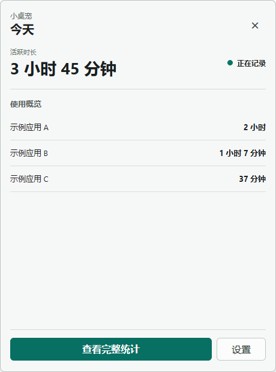
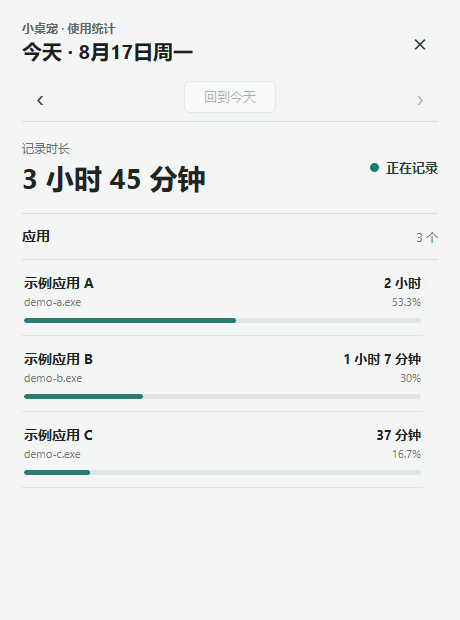

# 小桌宠

面向 Windows 的本地桌面宠物。桌宠是首要体验；软件使用统计只是它提供的第一个功能面板。

<p align="center">
  
</p>

小桌宠运行在 Windows 桌面上，保持轻量、可拖动的角色窗口。单击角色可打开其下方的快捷面板，再按需查看本地使用统计。

## 当前可用

- Windows 透明桌宠窗口，支持显示、隐藏、拖动和位置恢复。
- 单击桌宠打开或关闭快捷面板；面板提供今日概览、完整统计入口和设置入口。
- 桌宠大小可在 30% 到 160% 间调整，修改会立即应用并保存到本地。
- 本地软件使用统计，只计算用户活跃时位于前台的软件。
- 默认提供 `simple-cloud`（简洁云朵）皮肤；资源来源与授权记录见[角色资产说明](src-tauri/assets/README.md)。

下方界面以固定的“示例应用”数据生成，用于展示布局，不包含真实的软件使用记录。

### 快捷面板

<p></p>

### 完整统计

<p></p>

## 可插件化桌宠

桌宠核心已经可用；可插件化能力是正在构建的扩展方向。当前仓库的插件基础设施变更尚未完成验收，因此不能把安装、启用、禁用、商店或 SDK 当作可用功能。

```text
小桌宠 Core Host
  状态：开发中
  ├─ 桌宠窗口与基础交互（已实现）
  ├─ 本地存储与受控接口（开发中）
  └─ 官方预设插件（开发中）
       ├─ 统计 / 快捷面板 / 大小 / 默认皮肤
       └─ .petpack 与本地目录（开发中）
            └─ Bun / TypeScript SDK（规划中）
```

首个方向是从只有一套默认皮肤的桌宠开始，再由本地目录提供可发现的官方资源。`.petpack` 只面向声明式资源包，不执行任意 JavaScript、DLL、WASM 或脚本；协议草案见[插件包说明](docs/plugin-protocol/README.md)。实际的导入、安装、启用、禁用和管理界面仍属于[插件基础设施变更](openspec/changes/add-plugin-system-foundation/proposal.md)，请以该变更的验收状态为准。

### 能力状态

| 能力 | 状态 | 依据 |
| --- | --- | --- |
| 桌宠窗口、点击快捷面板、大小设置、本地统计 | 已实现 | [桌宠生命周期](src-tauri/src/lifecycle.rs)、[快捷面板](src/QuickPanel.svelte)、[统计界面](src/App.svelte) |
| 默认 `simple-cloud` 皮肤与本地资源授权记录 | 已实现 | [角色资产说明](src-tauri/assets/README.md) |
| Core Host、官方预设插件、本地插件目录、`.petpack` 导入与安装状态管理 | 开发中 | [add-plugin-system-foundation](openspec/changes/add-plugin-system-foundation/proposal.md) |
| 插件启用、禁用、卸载与管理界面的 Windows 验收 | 开发中 | [插件变更任务](openspec/changes/add-plugin-system-foundation/tasks.md) |
| Bun / TypeScript SDK | 规划中 | [插件协议草案](docs/plugin-protocol/README.md) |
| 在线目录、插件商店、自动更新、可执行逻辑插件 | 规划中 | 不在当前变更范围内 |

状态含义：**已实现**表示现有核心代码与自动化检查支持；**开发中**表示已有设计或实现，但尚未完成验收；**规划中**表示已经明确方向，尚未作为当前能力交付。

## 快速开始

### 环境要求

- Windows 10/11 x64。
- 系统已安装 Microsoft Edge WebView2 Runtime。
- Bun。
- Rust 稳定工具链（MSVC 目标）。

### 安装与运行

```powershell
bun install
bun run tauri:dev
```

首次启动应先显示桌宠；完整统计会在从快捷面板或托盘进入时按需打开。仓库没有发布安装包、下载页或在线插件目录。

## 开发与验证

前端检查、测试和构建命令来自当前 `package.json` 与 Tauri 配置：

```powershell
# 类型与 Svelte 检查
bun run check

# Vitest 测试（包含 README 内容核验）
bun test

# 前端构建
bun run build

# Windows x64 Tauri 构建
bun run tauri:build
```

`src-tauri/tauri.conf.json` 的开发入口会调用 `bun run dev`，并连接到 `http://127.0.0.1:1420`；Tauri 打包目标是 `x86_64-pc-windows-msvc`。

## 隐私

- 使用统计与设置数据只保存在本地，不做云同步，也不发送遥测。
- 只统计用户活跃时位于前台的软件；连续五分钟无输入、锁屏或系统挂起时暂停记录。
- 不收集窗口标题、文档名、键盘内容、截图或网络活动。
- README 截图使用固定示例数据；不会写入或展示本机的真实使用明细。

## 项目结构

```text
src/
  Svelte 统计页与快捷面板
src-tauri/src/
  Rust、Tauri、Windows 桌宠与本地存储
src-tauri/assets/
  内置桌宠资源及其授权说明
docs/assets/readme/
  README 专用媒体
docs/plugin-protocol/
  开发中的 .petpack 协议草案
openspec/changes/
  需求、设计、任务与验收记录
```

## OpenSpec 开发方式

功能变更先在 `openspec/changes/<change-name>/` 中记录 proposal、design 和 tasks，再实施代码和验证。常用命令：

```powershell
openspec list
openspec status `
  --change "<change-name>" --json
openspec validate "<change-name>" --strict
```

提交前请同步更新真实完成的任务状态，并为行为变化添加相应自动化验证。README 本身的变更也应保持截图、命令、链接和能力状态与仓库一致。

## 路线图

| 阶段 | 状态 | 内容 |
| --- | --- | --- |
| 桌宠核心与本地统计 | 已实现 | 桌宠窗口、快捷面板、大小设置、默认皮肤与本地统计。 |
| 插件基础设施 | 开发中 | Core Host、官方预设插件、`.petpack`、本地插件目录和管理流程。 |
| SDK | 规划中 | Bun / TypeScript 工具用于创建、校验和打包声明式资源。 |
| 在线目录与逻辑插件 | 规划中 | 不引入账号、云同步、遥测、网络下载或任意代码执行。 |

## 资源授权与贡献

桌宠资源的来源、授权依据和发布限制以[角色资产说明](src-tauri/assets/README.md)为准；其中未获授权的研究素材不会进入发布包。仓库当前未提供单独的许可证、发布页或贡献指南，因此 README 不为这些入口创建占位链接。

贡献请从一个 OpenSpec 变更开始：说明目标与隐私影响，保持实现范围最小，补充验证，并在提交前运行严格校验。
